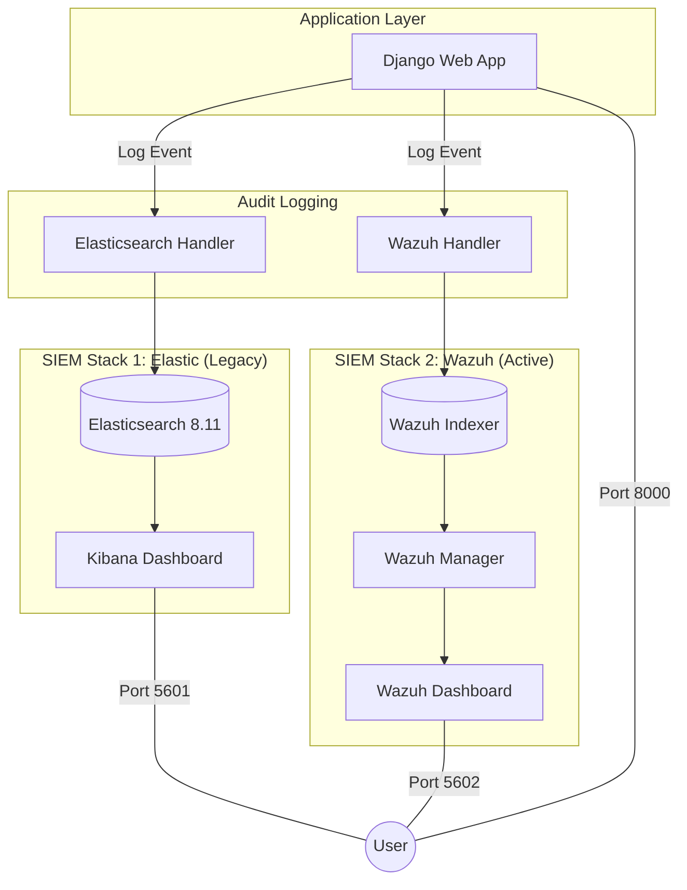

# SIEM Project (Django + Elasticsearch + Wazuh)

A comprehensive SIEM (Security Information and Event Management) system that integrates Django authentication events with a dual-stack logging architecture: **Elastic Stack** and **Wazuh**.

---

## 🏗 Full Product Architecture

The system operates as a dual SIEM environment, allowing for side-by-side comparison and redundant security monitoring.



### Component Details
- **Django**: Handles user login/logout. Custom signals trigger audit logs sent to both handlers.
- **Elasticsearch (Port 9200)**: Standard log aggregation for general application auditing.
- **Wazuh Indexer (Port 9205)**: OpenSearch-based storage optimized for security events.
- **Wazuh Manager**: Processes logs, applies security rules, and triggers alerts.
- **Wazuh Dashboard (Port 5602)**: Specialized interface for threat hunting and compliance.

---

## 🪟 Detailed Windows Setup Guide

Setting up this environment on Windows requires specific configurations for Docker and Python.

### 1. Prerequisites
- **Docker Desktop**: [Download here](https://www.docker.com/products/docker-desktop/).
- **WSL 2**: Ensure WSL 2 is installed and set as the default version.
- **Python 3.10+**: [Download here](https://www.python.org/downloads/windows/).

### 2. Configure Docker Desktop (CRITICAL)
The dual SIEM stack is resource-heavy. Failing to allocate enough RAM will cause containers to crash.
1.  Open **Docker Desktop Settings**.
2.  Go to **Resources** > **Advanced**.
3.  Allocate **at least 4 GB of RAM** (8 GB recommended).
4.  Allocate **at least 2 CPUs**.
5.  Click **Apply & Restart**.

### 3. Initialize Backend Infrastructure
Open **PowerShell** or **Command Prompt** in the project root:
```powershell
# Start the containers
docker-compose up -d
```
> [!NOTE]
> Wait approximately **60 seconds** for all services (Elasticsearch, Kibana, Wazuh Indexer) to fully initialize before starting the Django app.

### 4. Setup Python Environment
On Windows, use `venv` to manage your dependencies:
```powershell
cd siem_project

# Create virtual environment
python -m venv venv

# Activate virtual environment
.\venv\Scripts\activate

# Install dependencies
pip install -r requirements.txt
```

### 5. Run the Django Application
```powershell
python manage.py migrate
python manage.py runserver
```

---

## 🔗 Accessing the Dashboards

| Service | URL | Credentials |
| :--- | :--- | :--- |
| **Django App** | `http://localhost:8000` | Created via `createsuperuser` |
| **Kibana** | `http://localhost:5601` | No Auth (Development Mode) |
| **Wazuh Dashboard** | `https://localhost:5602` | `admin` / `SecretPassword1!` |

---

## 🔄 Common Windows Troubleshooting

- **Port Conflicts**: If port 9200 or 5601 is in use, modify the `docker-compose.yml` and `settings.py`.
- **Memory Limits**: If Elasticsearch exits with code 137, increase Docker RAM allocation.
- **SSL Certificates**: Wazuh Dashboard uses HTTPS. Your browser may display a "Your connection is not private" warning; click **Advanced** > **Proceed to localhost (unsafe)**.
- **Execution Policy**: If you cannot run `. \venv\Scripts\activate`, run `Set-ExecutionPolicy -ExecutionPolicy RemoteSigned -Scope CurrentUser` in PowerShell as administrator.

